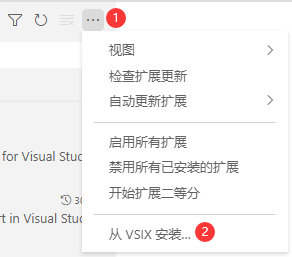
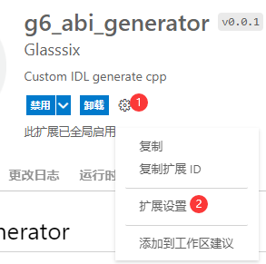

# Mercury

Mercury是实现自定义IDL语言自动展开为C++代码的项目，该项目基于[LLVM](https://github.com/llvm/llvm-project)实现。项目包含以下部分：

- include：使用abi_interface_generator库所需的头文件；
- src：基于[LLVM](https://github.com/llvm/llvm-project)实现IDL展开为C++代码的核心库，包含IDL的解析和C++代码的生成；
- app：调用abi_interface_generator库的一个控制台工具，使用此工具可将IDL转换为C++代码；
- data：展开为C++代码的模板文件，修改模板文件可改变生成后的C++代码；
- idl_file：测试所使用的IDL文件；
- test：测试代码；
- VsPlugin：vs插件代码；
- VscodePlugin：vscode插件代码。

# 编译

Mercury基于C++17编写，其依赖于[LLVM](https://github.com/llvm/llvm-project)、[inja](https://github.com/pantor/inja)和[GoogleTest](https://github.com/google/googletest)项目。

| 系统      | windows                   |
| --------- | ------------------------- |
| 编译器    | Microsoft Visual C++ 2019 |
| cmake版本 | 3.18                      |

编译完成后在编译输出目录下存在如下文件：

- abi_interface_generator.lib
- abi_interface_generator.dll
- interface_generator_app.exe

# APP说明

使用工具`interface_generator_app.exe`前请将`data`目录复制到`interface_generator_app.exe`所在目录。

## IDL规则

较为完整的IDL编写示例参考`idl_file/Object.h`文件。

### 支持的变量类型

IDL类型对应于C++的类型如下：

| IDL类型 | C++类型            |
| ------- | ------------------ |
| bool    | bool               |
| int8    | std::int8_t        |
| int16   | std::int16_t       |
| int32   | std::int32_t       |
| int64   | std::int64_t       |
| uint8   | std::uint8_t       |
| uint16  | std::uint16_t      |
| uint32  | std::uint32_t      |
| uint64  | std::uint64_t      |
| float   | float              |
| double  | double             |
| string  | std::string        |
| span    | std::span （C++20) |
| vector  | std::vector        |

### 支持的属性（Attributes）

| 属性      | 修饰对象    | 说明                                                     |
| --------- | ----------- | -------------------------------------------------------- |
| [[set]]   | IDL字段     | 只写字段，仅提供`set...`函数                             |
| [[get]]   | IDL字段     | 只读字段，仅提供`get...`函数                             |
| [[in]]    | IDL接口参数 | 输入参数，值不会被修改                                   |
| [[out]]   | IDL接口参数 | 输出参数，值在函数体内会被修改，但不会读取               |
| [[inout]] | IDL接口参数 | 输入输出参数，值在函数体内会被修改，且函数体内会读取该值 |

- IDL字段不加任何修饰表示可读可写，即提供`set...`和`get...`函数；

- IDL接口参数不加任何修饰表示输入参数，即等价于[[in]]修饰。

### 嵌套

一个IDL文件可以采用`#include "..."`的方式引入其依赖的文件。

## 示例

### 示例1：单文件

1. 编写IDL

   新建一个`Rect.h`文件，在其中编写如下内容

   ```cpp
   #pragma once //此文件可能被其它文件include，避免重复包含
   
   namespace g6
   {
   	interface Rect
   	{
           // 属性字段
           int32 x;
           int32 y;
           int32 width;
           int32 height;
           
           // 接口函数
   		bool empty() const;
           void centre([[out]] int32 x, [[out]] int32 y);
   	};
   }
   ```

2. 编译IDL

   ```bash
   ./interface_generator_app.exe -i rect.h -o ./
   ```

   执行以上命令后在当前目录下生成`Rect.hpp`和`Rect_impl.hpp`。其中Rect.hpp为符合自定义ABI兼容规则的接口代码，Rect_impl.hpp为用户需要实现的接口头文件。

   生成的接口主要如下：

   ```cpp
   namespace glasssix::g6
   {
   	inline constexpr exposing::utf8_string_view Rect_qualified_name{ u8"g6.libnamexxx.image" };
   
   	class Rect_impl : public exposing::implements<Rect_impl, Rect>, public exposing::make_external_qualified_name<Rect_qualified_name>
   	{
   	public:
   		Rect_impl();
   		~Rect_impl();
   
   		bool empty() const;
   		void centre(std::int32_t& x, std::int32_t& y);
   		void set_x(std::int32_t x);
   		std::int32_t get_x() const;
   		void set_y(std::int32_t y);
   		std::int32_t get_y() const;
   		void set_width(std::int32_t width);
   		std::int32_t get_width() const;
   		void set_height(std::int32_t height);
   		std::int32_t get_height() const;
   	};
   }
   ```

### 示例2：文件嵌套

1. 编写IDL

   新建一个`Point.h`文件，在其中编写如下内容

   ```cpp
   #pragma once
   
   namespace g6
   {
   	interface Point
   	{
           // 属性字段
           int32 x;
           int32 y;
   	};
   }
   ```

   新建一个`Line.h`文件，在其中编写如下内容：

   ```cpp
   #pragma once
   #include "Point.h"//引入依赖的IDL文件
   
   namespace g6
   {
   	interface Line
   	{
           // 属性字段
           [[get]]vector<Point> data;
           
           // 接口
           int32 count() const;
           Point at(int32 n) const;
   	};
   }
   ```

2. 编译IDL

   ```bash
   ./interface_generator_app.exe -i Line.h -o ./
   ```

# 插件说明

## Visual Studio 插件

### 编译安装

1. 使用**Visual Studio 2019**打开**VsPlugin/G6IdlToCpp.sln**工程，编译此工程后，在项目输出目录下将生成**G6IdlToCpp.vsix**插件；
2. 关闭所有 Visual Studio，双击 G6IdlToCpp.vsix 即进行插件安装。

### 使用

1. 配置代码生成器路径，即interface_generator_app.exe所在路径；

   

2. 打开需要生成C++代码的接口文件，点击鼠标右键菜单的”IDL To CPP“即可生成C++代码文件。

## Visual Studio Code 插件

### 编译安装

1. 安装[Node.js](https://nodejs.org/en/)

2. 安装打包工具`vsce`

   ```shell
   npm i vsce -g
   ```

3. 打包成`vsix`文件：进入VscodePlugin目录，执行打包命令

   ```shell
   vsce package
   ```

打包完成将在当前路径下生成**g6-abi-generator-0.0.1.vsix**插件。打开vscode的插件市场，选择**从VSIX安装**即可安装插件。



### 使用

1. 配置代码生成器路径，即interface_generator_app.exe所在路径；

   - 进入插件设置

   

   - 选择在settings.json中进行编辑

   

   - 在json中增加生成器路径，如下所示：

     ```json
     {
         // ...
         "g6-abi-generator.generatorPath": "C:\\Users\\Glasssix-KP\\Tool",
         "g6-abi-generator.outputPath": "."
     }
     ```

2. 打开需要生成C++代码的接口文件，点击鼠标右键菜单的”IDL To CPP“即可生成C++代码文件。

# 运行测试

运行测试之前请将 `data` 和 `idl_file` 目录复制到`abi_interface_generator_test.exe`所在目录。

